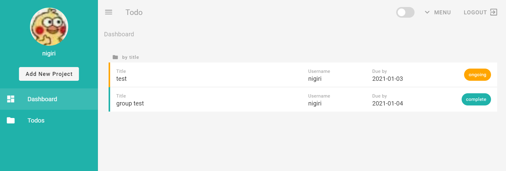
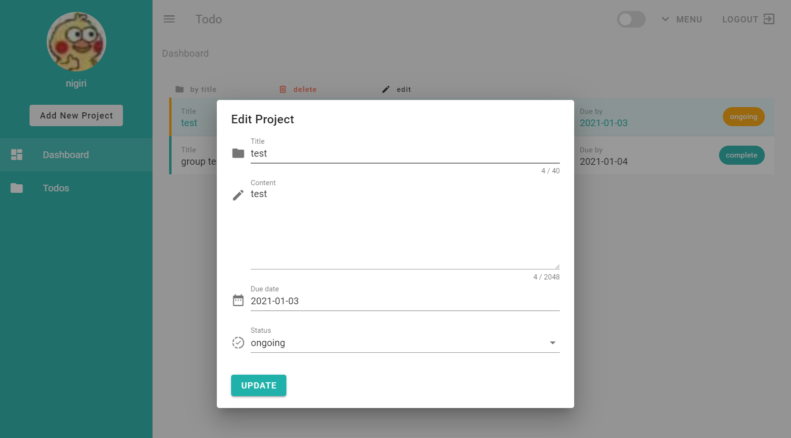

# todo
## 简介
基于 vue，vuetify，vuex，router，firebase 开发的 todo 应用。

## 项目设置
### 修改配置
#### firebase 连接配置
firebase.config.js
```vue
export const firebaseConfig = {
  apiKey: "",
  authDomain: "",
  databaseURL: "",
  projectId: "",
  storageBucket: "",
  messagingSenderId: "",
  appId: "",
  measurementId: ""
};
```

### 安装依赖
```
npm install
```

### 开发阶段编译和热重载
```
npm run serve
```

## 预览
### 首页

### 编辑


## TodoList
- [x] Vuex 统一管理和存储组件状态数据
- [x] Firebase 实时更新数据
- [ ] 视图：
  - [x] 仪表盘
  - [x] 登录
  - [x] 注册
- [ ] 功能：
  - [x] 夜间模式切换
  - [x] 增删改查 Todo
  - [ ] 页面加载进度条
  - [ ] Firebase 用户认证
- [x] 重构：
  - [x] 用 TypeScript 重构项目
